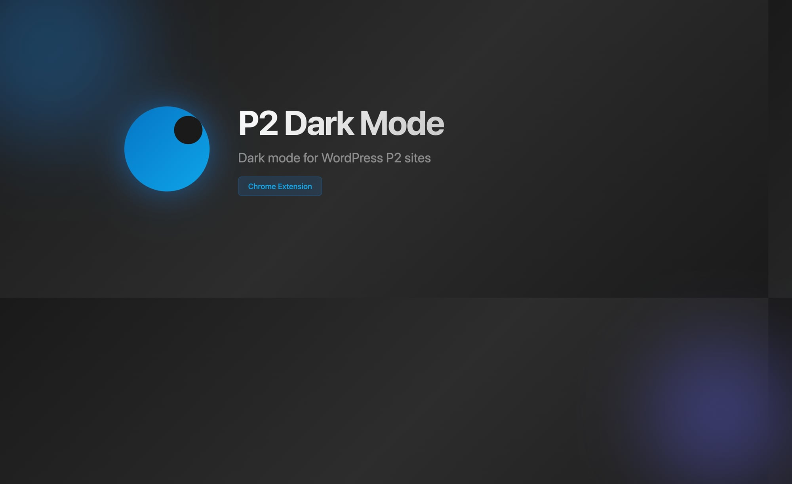

# P2 Dark Mode



A Chrome extension that adds dark mode to WordPress P2 sites, respecting your system's dark mode preference.

## Features

- 🌙 Automatic dark mode based on system preference
- ⚡ Smooth loading with no white flash
- 🎯 Only activates on P2 sites you approve
- 🔔 Prompts to enable on new P2 sites (URLs ending in `p2.wordpress.com`)
- ⚙️ Easy management via popup

## Installation

### From zip file (Developer Mode)

1. Download and unzip `p2-dark-mode-v1.0.0.zip`
2. Open Chrome and go to `chrome://extensions`
3. Enable **Developer mode** (toggle in top right)
4. Click **Load unpacked**
5. Select the unzipped folder
6. Done! You'll see the P2 Dark Mode icon in your toolbar

### From source

```bash
git clone <repo-url>
cd p2-dark-mode
```

Then follow steps 2-6 above, selecting the cloned folder.

## Usage

### Enabling dark mode on a P2

**Option A: Via prompt**
- Visit any P2 site (URL ending in `p2.wordpress.com`)
- A prompt will appear: "Enable dark mode on this P2?"
- Click **Enable**

**Option B: Via popup**
- Click the P2 Dark Mode icon in your toolbar
- Click **Enable dark mode on this site**

### Disabling dark mode

- Click the P2 Dark Mode icon
- Click **Disable dark mode on this site**

### Managing sites

Click the extension icon to see:
- Current site status
- List of all enabled sites
- Remove sites by clicking the × next to them

## How it works

- Only runs on `*.wordpress.com` subdomains
- Checks your allowlist before applying styles
- Uses your system's dark mode preference (`prefers-color-scheme`)
- Injects a scrim overlay to prevent white flash during load
- Applies carefully crafted dark styles to P2 elements

## Pre-configured sites

These P2s have dark mode enabled by default:
- designomattic.wordpress.com
- aip2.wordpress.com
- growthp2.wordpress.com
- learningp2.wordpress.com
- dotcomdesignp2.wordpress.com

You can remove any of these via the popup.

## Privacy

- No data collection
- No external requests
- All settings stored locally via `chrome.storage.sync`
- Only activates on wordpress.com subdomains

## Development

```
p2-dark-mode/
├── src/                   # Extension source
│   ├── manifest.json      # Extension manifest (v3)
│   ├── content.js         # Main content script
│   ├── popup.html         # Popup UI
│   ├── popup.js           # Popup logic
│   ├── styles/
│   │   └── dark.css       # Dark mode styles
│   └── icons/
│       ├── icon-16.png
│       ├── icon-48.png
│       └── icon-128.png
├── build/                 # Packaged releases
│   └── p2-dark-mode-v0.1.0.zip
└── README.md
```

### Loading for development

1. Go to `chrome://extensions`
2. Enable **Developer mode**
3. Click **Load unpacked**
4. Select the `src/` folder

### Building a release

```bash
cd src && zip -r ../build/p2-dark-mode-v0.1.0.zip . -x "*.DS_Store"
```

## License

MIT
